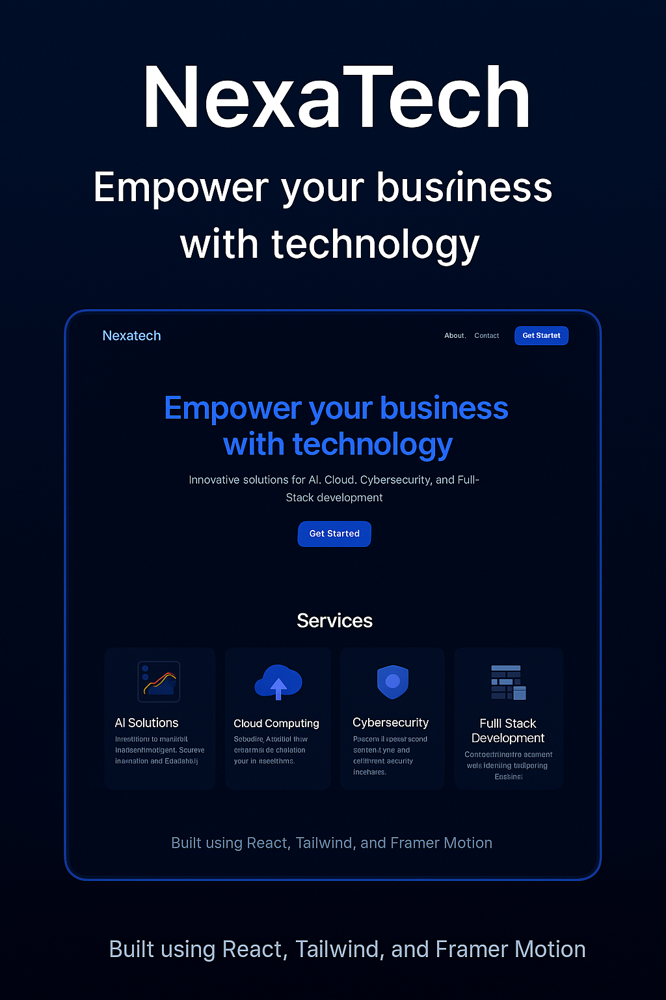

# ⚡ NexaTech – Next-Gen Tech Solutions Website

**NexaTech** is a sleek, responsive front-end website built for a fictional enterprise tech company specializing in **AI**, **Cloud**, **Cybersecurity**, and **Full-Stack Development**.

🔗 [🌍 Live Demo](https://suhaib-zaid.github.io/nexatech)

---

## 📸 Preview



---

## 🚀 Features

- ✨ Modern, clean UI with **dark mode** support
- ⚡ Smooth animations using **Framer Motion**
- 🔍 Fully responsive design for all screen sizes
- 🧠 Showcases key services like:
  - Artificial Intelligence
  - Cloud Solutions
  - Cybersecurity
  - Full-Stack Web Development

---

## 🖼️ Sections Included

- 🏠 Hero (Call-to-action)
- 👨‍💻 About Us
- 💼 Services Grid (6 total)
- 📬 Contact Form
- 🧾 Footer with branding

---

## 🛠 Tech Stack

| Frontend        | Tools & Libraries                   |
|-----------------|--------------------------------------|
| React.js        | Component-based SPA framework        |
| Tailwind CSS    | Utility-first modern styling         |
| Framer Motion   | Smooth entrance + scroll animations  |
| Lucide Icons    | Clean, modern SVG icons              |
| GitHub Pages    | Hosting the production build         |

---

## 🧪 Local Setup

To run the project locally:

```bash
git clone https://github.com/Suhaib-Zaid/nexatech.git
cd nexatech
npm install
npm start
